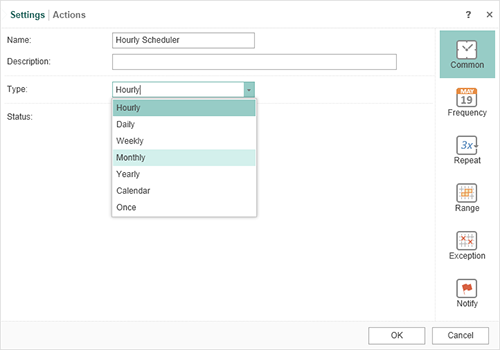

# Scheduling Frequency

The flexibility of the scheduler is implemented through the variety of options for setting the frequency of execution of actions. There are seven types of the scheduler implemented in the classes:

* StiCalendarScheduler

* StiDailyScheduler

* StiHourlyScheduler

* StiMonthlyScheduler

* StiOnceScheduler

* StiWeeklyScheduler

* StiYearlyScheduler


In the **Stimulsoft Server** interface the type of a scheduler is set as follows:




There are special methods that return a new class of type **StiSchedulerItem** to make it easier to work with schedulers of different types:


**Name**

**Description**

**SetHourlyFrequency**

(int runAtMinute)

Hourly launch actions in runAtMinute minutes;

**SetDailyFrequency**

(int runAtHour, int runAtMinute = 0)

Daily launch actions in runAtHour hours runAtMinute minutes;

**SetWeeklyFrequency**

(StiDaysOfWeek daysOfWeek,

int runAtHour = 0, int runAtMinute = 0)

Weekly launch actions in daysOfWeek day of week, runAtHour hours, runAtMinute minutes. StiDaysOfWeek it is the enumeration of days of the week, empty value (None) and value for all days of the week (All);

**SetMonthlyFrequency**

(StiMonths runAtMonth, StiDays runAtDay,

int runAtHour = 0, int runAtMinute = 0)

Monthly launch actions in runAtMonth month, runAtDay day, runAtHour hours, runAtMinute minutes. This type of the scheduler starts actions in concrete day of month at the appointed time: 12th or last day of month. StiMonths it is the enumeration of months of the year, empty value (None) and value for all months of the year (All). StiDays it is the enumeration of days of the month, empty value (None), value for all days of the month (All) and value for the last day of the month (Last);

**SetMonthlyFrequency**

(StiMonths runAtMonth, StiDaysOfWeek daysOfWeek,

StiNumberOfDays numberOfDays, int runAtHour = 0,

int runAtMinute = 0)

Monthly launch actions in runAtMonth month, daysOfWeek day of the week, numberOfDays number of week, runAtHour hours, runAtMinute minutes. This type of the scheduler starts actions in a relative day of a month at the appointed time: every second Thursday of month or last Friday of month. StiMonths is the enumeration of months of the year, empty value (None) and value for all months of the year (All). StiDaysOfWeek it is the enumeration of days of the week, empty value (None) and value for all days of the week (All). StiNumberOfDays it is the enumeration of values First, Second, Third, Fourth, Fifth, empty value (None) and value for all items (All);

**SetYearlyFrequency**

(StiMonths runAtMonth, StiDays runAtDay,

int runAtHour = 0, int runAtMinute = 0)

Yearly launch actions in runAtMonth month, runAtDay day, runAtHour hours, runAtMinute minutes. StiMonths it is the enumeration of months of the year, empty value (None) and value for all months of the year (All). StiDays it is the enumeration of days of the month, empty value (None), value for all days of the month (All) and value for the last day of the month (Last);

**SetCalendarFrequency**

(StiCalendarItem calendarItem, int runAtHour = 0,

int runAtMinute = 0)

launch actions in runAtHour hours, runAtMinute minutes by dates of a calendar calendarItem (the StiCalendarItem element, has to be created in advance);

**SetExceptionCalendar**

(StiCalendarItem exceptionCalendarItem)

set a calendar of exceptions - a list of dates on which the action will not be executed;

**SetDateRange**

(DateTime? startDate, DateTime? endDate)

set the range of dates of activity of the scheduler;

**SetRunEvery**

(int runEvery)

sets the shift in the launch of actions the scheduler, for example, if set to 2 then the event will be run every second time of activation the scheduler, if set to 5 - every fifth time;

**SetExcludeWeekendDays**

(bool excludeWeekendDays)

if set to True then excludes the execution of actions of the scheduler in the weekends;

**SetTimeZone**

(string timeZone)

set required time zone;

**SetRunOnce**()

if set to True then actions of the scheduler are executed once;

**SetRepeat**

(int repeatCount, float repeatRate,

StiRepeatType repeatType)

repeat actions of the scheduler repeatCount times with the interval of repeatRate hours or minutes (StiRepeatType it is the enumeration of values Hours and Minutes).

This example sets start of the scheduler’s actions each 8 hours:


**.NET API**

```
...
public void CreateSchedulerAndSetFrequencyTo8h()
{
    var connection = new Stimulsoft.Server.Connect.StiServerConnection("localhost:40010");
    connection.Accounts.Users.Login("UserName@example.com", "Password");
    
    var schedulerItem = connection.Items.Root.NewScheduler("scheduler", StiSchedulerIdent.Hourly).Save();
    
    schedulerItem = schedulerItem.SetHourlyFrequency(8);
    schedulerItem.Save();
    
    connection.Accounts.Users.Logout();
}
...
```

An asynchronous method sets start of the scheduler actions by dates of a calendar:


**.NET API**

```
...
public async void CreateSchedulerAndSetFrequencyCalendarAsync()
{
    var connection = new Stimulsoft.Server.Connect.StiServerConnection("localhost:40010");
    await connection.Accounts.Users.LoginAsync("UserName@example.com", "Password");
    
    var calendarItem = connection.Items.Root.NewCalendar("calendar");
    calendarItem.Dates.Add(new StiCalendarDate("First day of 2020", new DateTime(2020, 01, 01)));
    await calendarItem.SaveAsync();
    
    var schedulerItem = connection.Items.Root.NewScheduler("scheduler", StiSchedulerIdent.Hourly);
    
    schedulerItem = schedulerItem.SetCalendarFrequency(calendarItem);
        
    await schedulerItem.SaveAsync();
    
    await connection.Accounts.Users.LogoutAsync();
}
...
```
