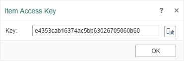

# Sharing Items

To work with elements uses a unique identifier - keys. They are assigned automatically when you create elements.




Press the **Access Key** command from the **More** menu to get the key.


The key can be used to specify a particular item in the API and to access an item outside over HTTP. This example demonstrates a simple HTML-page that provides access to the report in the public domain:


**.NET API**

```
...
<html>
<head>
    <title>Sharing example</title>
</head>
<body>
    <p style="font-size: 40px;">The example of shared report.</p>
    <br>
    <iframe src="http://localhost:40010/share/13f5d51dd5294a9483facdf61299000a"></iframe>
</body>
</html>
...
```
