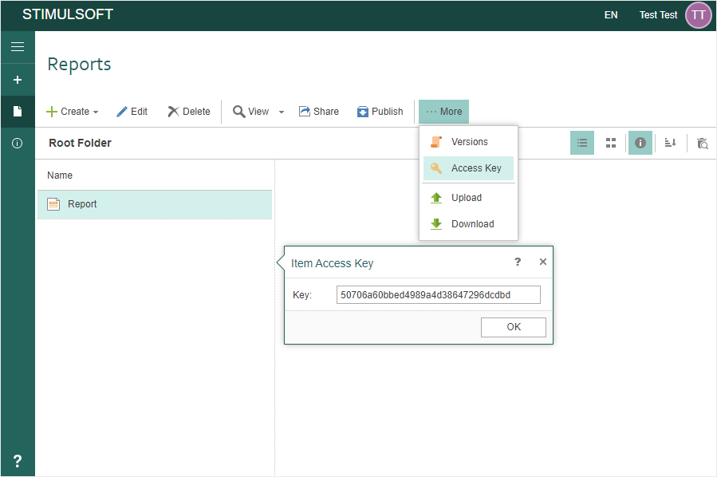

# Download

**Description**:

You can download any element. For this, you need to know its unique key. You can [get the Item key using the Access Key command](https://www.stimulsoft.com/en/documentation/online/server-manual/index.html?toolbar.htm) in your [Stimulsoft Cloud account](https://cloud.stimulsoft.com/).




**Url Structure**:

http://reports.stimulsoft.com/1/files/{ItemKey}


**Method**:

GET


**Parameters**:

A custom header x-sti-SessionKey contains the session key of the current user.


**CURL example**:

curl -X GET -H "x-sti-SessionKey: 22ed00099bd24fffacf9d5ad2344f457" http://reports.stimulsoft.com/1/files/a8dde8679ecb43cbbba190786a2b44f3


**Returns**:

The JSON object containing the collection ResultItems, which contains a list of items in the specified folder of the current workspace. The success of the command execution is checked by the content of the field ResultSuccess.


**Sample JSON response**

```
...
{
  "Ident": "CommandListRun",
  "ContinueAfterError": false,
  "ResultCommands": [
    {
      "Ident": "ItemGet",
      "AllowDeleted": false,
      "ResultItem": {
        "Ident": "FileItem",
        "FileType": "Pdf",
        "ShareLevel": "Private",
        "HasItems": false,
        "StateKey": "3",
        "WorkspaceKey": "8a87e146d96e4b2e9aa127b22d6d98df",
        "Name": "Test",
        "Description": "This is a TEST",
        "Created": "\/Date(1588776549597)\/",
        "Modified": "\/Date(1588776602287)\/",
        "Visible": true,
        "Deleted": false,
        "IsMoveable": true,
        "Key": "6ad634d0764849b9801600ad8f7fe56b"
      },
      "ResultLastVersionKey": "87ea176df38346209cb4561ad86a8840",
      "ResultSuccess": true
    },
    {
      "Ident": "ItemResourceGet",
      "ResultResource": "JVBERi0xLjcNCiXi48/TDQoxIDAgb2JqDD........................", //your pdf file content
      "ResultSuccess": true
    }
  ],
  "ResultSuccess": true
}
...
```
