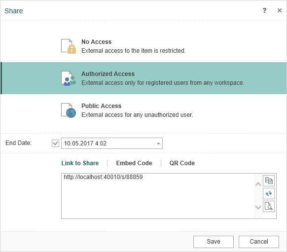

# Share

Some elements of the navigator tree (StiFileItem, StiReportSnapshotItem, StiReportTemplateItem), can have access from the outside, declared in one of the three levels ShareLevel (Private, Registered and Public). You can also set an expiration date of public access. Manually these parameters can be set on the following form:

Software functionality is described using the command Items Share.

**Name**

**Description**

**GET Info**

Getting information about access parameters of specified item in the workspace of the logged-in user

**PUT Edit**

Changing information about access parameters of specified item in the workspace of the logged-in user.

**DELETE Reset**

Resetting access parameters of specified item in the workspace of the logged-in user to default. These are ShareLevel, established in Private (no public access), ShareMode set in Download, as well as the absence of ShareExpires (period of validity of link of public access).

**Items Attach (PUT)**

Attaching one item to another. Items of type StiReportTemplateItem and StiFileItem support attaching of elements. Keys of the attached elements are in the AttachedItems collection. Attaching of elements is necessary for data binding. For example, it is possible to attach DataSource and images (FileItem) to a ReportTemplate to use these data in the report. It is possible to attach the XSD-file to the XML-file to connect the scheme of the XML-document with its data.

**Items Detach (PUT)**

Detaching one item from another. Keys of the attached elements are in the AttachedItems collection.
