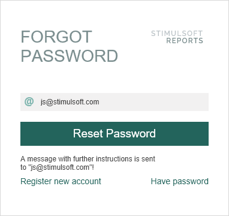

## Reset password




**Description**:

Activating of password reset. At this stage, checked the security code, and if it is correct, the password is reset to the new specified in the parameters. To activate the procedure requires new password and the secret code obtained at the first stage. Executing this command does not require a session key.


**Url Structure**:

http://reports.stimulsoft.com/1/resetpassword/secretcode


**Method**:

PUT


**Parameters**:

A custom header x-sti-NewPassword contains the new password. The secretcode parameter in the URI is the secret code obtained in the first stage of the procedure a password reset, and indicates the user whose password you want to reset. The secret code is valid for two hours from the time of the query reset your password.


**CURL example**:

curl -X PUT -H "x-sti-NewPassword: 222222" -d "" http://reports.stimulsoft.com/1/resetpassword/04c86e980d2042079ee675ae09e495e9


**Returns**:

The JSON object containing the field ResultSuccess which indicates that the command is executed successfully.


**Sample JSON response**

```
...
{
  "Ident": "UserResetPasswordComplete",
  "ResultUserName": "j@d.com",
  "ResultSuccess": true
}
...
```
